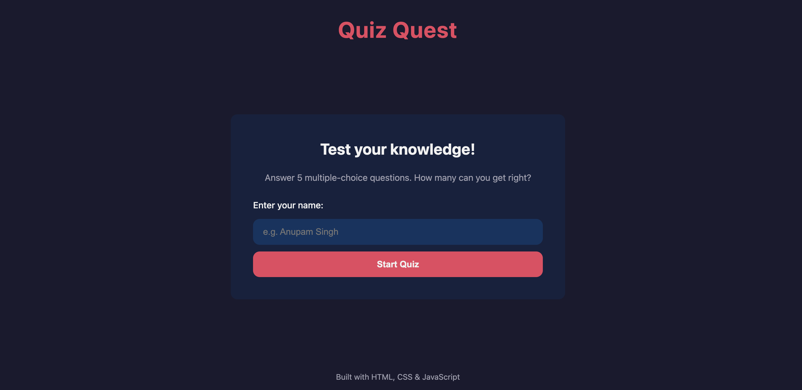
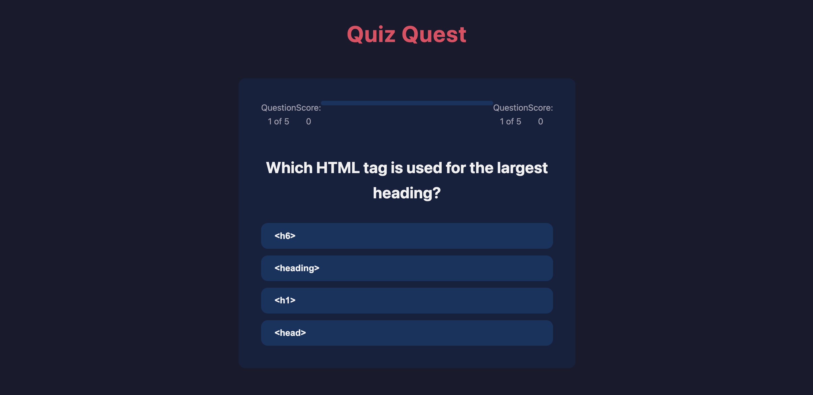
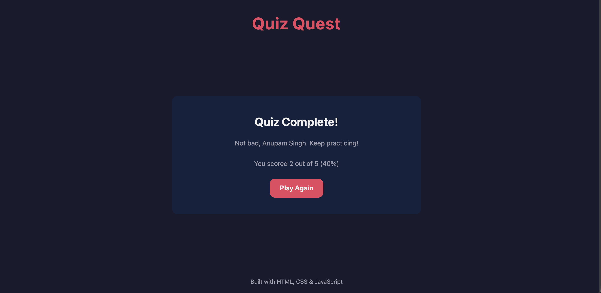

# Quiz Quest 🎯

A multiple-choice quiz app built with vanilla HTML, CSS, and JavaScript. No frameworks, no libraries — just the fundamentals.

🔗 **[Live Demo](https://YOUR-USERNAME.github.io/quiz-quest/)** *(coming after Step 5c)*

## Screenshots

### Start Screen


### Quiz in Progress


### Results


## Features

- 5-question multiple-choice quiz
- Live score tracking and progress bar
- Visual feedback on each answer (green for correct, red for wrong)
- Personalized end-game message based on performance
- Smooth fade transitions between screens
- Fully responsive — works on mobile and desktop
- Play again without refreshing

## Tech stack

- **HTML5** — semantic markup, form validation
- **CSS3** — custom properties, flexbox, transitions, keyframe animations, media queries
- **Vanilla JavaScript** — DOM manipulation, event listeners, array methods, template literals

No build step. No dependencies. Just open and run.

## Run locally

```bash
git clone https://github.com/AnupamAS02/quiz-quest.git
cd quiz-quest
open index.html